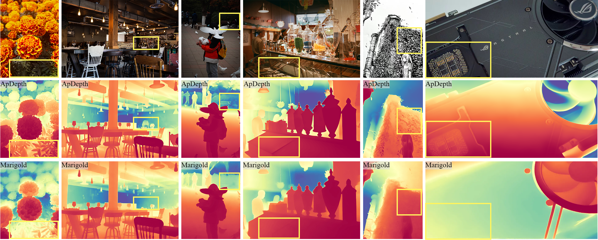

<h1>SJZU
<em style="color: #382f90">Computer Vision and Remote Sensing Lab</em> 
</h1>

**CVRS-YS801** is the Computer Vision and Remote Sensing Lab of **Shenyang Jianzhu University**, led by [**Prof. Yuan Shuai**](https://syjz.teacher.360eol.com/teacherBasic/preview?teacherId=23776).

Our research focuses on **Depth Estimation, Image Stitching, Object Detection**.
The organization hosts research code, experiments, and collaborative projects developed by members of the lab.

<h2 align="center">Member</h2>

    

        <a href="https://github.com/Dimon0000000">
            
             
            <b>Dimon</b>
        </a>
    

    

        <a href="https://github.com/Haruko386">
            
             
            <b>Haruko386</b>
        </a>
    

    

        <a href="https://github.com/WuSangui571">
            
             
            <b>Sangui</b>
        </a>
    

    

        <a href="https://github.com/Ltohka">
            
             
            <b>Tohka</b>
        </a>
    

    

        <a href="https://github.com/lys863">
            
             
            <b>lys863</b>
        </a>
    

<!-- <h2 align="center">Publication</h2>

  

    
  

  

    

      <a href="https://haruko386.github.io/research/" style="font-weight: 700; color: #222; text-decoration: none; transition: color 0.2s;">
        ApDepth: Aiming for Precise Monocular Depth Estimation Based on Diffusion Models
      </a>
    

    

      <b>Jiawei Wang</b>, Shuai Yuan, Mingbo Lei
    

    

      <a href="https://haruko386.github.io/research/article.pdf" style="color: #0366d6; text-decoration: none; font-weight: 500;">[Paper]</a> 
      <a href="https://github.com/cvrs-ys801/ApDepth" style="color: #0366d6; text-decoration: none; font-weight: 500;">[Code]</a> 
      <a href="https://huggingface.co/spaces/developy/ApDepth" style="color: #0366d6; text-decoration: none; font-weight: 500;">[Demo 🤗]</a>
    

    

      <ul style="line-height: 1.6; margin: 0; padding-left: 20px;">
        <li style="margin-bottom: 10px;">
          We propose <b>ApDepth</b>, a diffusion-based framework for accurate monocular depth estimation with <b>single-step inference</b>.
        </li>
        <li style="margin-bottom: 10px;">
          The model integrates knowledge from both <b>data-driven methods</b> (e.g., Depth Anything) and <b>model-driven diffusion approaches</b>.
        </li>
        <li style="margin-bottom: 10px;">
          A novel architecture is designed to balance <b>detail preservation</b> and <b>efficient inference</b> with minimal computational overhead.
        </li>
        <li>
          Experiments demonstrate <b>competitive or superior performance</b> across multiple benchmark datasets.
        </li>
      </ul>
    

  

 -->